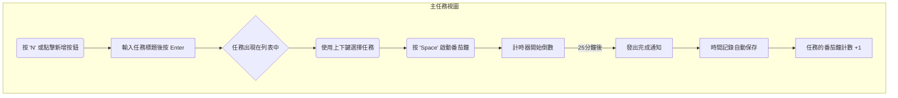

# DevFocus UI/UX 規格文件 (UI/UX Specification)

**版本**: 1.0  
**日期**: 2025-09-22  
**作者**: Sally (UX Expert)

## 1. 簡介 (Introduction)

本文件定義了 DevFocus 專案的使用者體驗 (UX) 目標、資訊架構、核心使用者流程及視覺設計規格。它旨在確保所有前端開發工作都圍繞著「最小化干擾」與「鍵盤優先」的核心原則，為開發者創造一個能長時間維持心流狀態的高效環境。

### 1.1 整體 UX 目標與原則 (Overall UX Goals & Principles)

#### 目標使用者畫像 (Target User Personas)

* **「專注的開發者 (The Focused Developer)」**: 我們的核心使用者。他們追求效率，厭惡不必要的點擊和干擾，偏好使用鍵盤快捷鍵來完成工作，並重視能幫助他們量化與改善工作效率的數據。

#### 可用性目標 (Usability Goals)

* **學習效率**: 新使用者應能在 1 分鐘內學會如何新增任務並啟動計時器。
* **操作效率**: 所有核心操作（新增/完成任務、啟動/停止計時）應能完全透過鍵盤完成，無需觸碰滑鼠。
* **錯誤預防**: 刪除等破壞性操作應有清晰的確認提示。

#### 設計原則 (Design Principles)

1. **無干擾 (Minimal Distraction)**: 介面元素應保持最低限度。除非絕對必要，否則不顯示任何內容。
2. **鍵盤優先 (Keyboard-First)**: 每一個功能都應優先考慮鍵盤操作的可及性，滑鼠操作是次要選項。
3. **即時反饋 (Immediate Feedback)**: 使用者的每個操作都應得到立即、細微且有意義的系統反饋，以增強掌控感與成就感。
4. **內容為王 (Content is King)**: 使用者的任務列表是介面的絕對核心，所有設計都應服務於如何更清晰地呈現與管理這些任務。

### 1.2 變更日誌 (Change Log)

| 日期 | 版本 | 描述 | 作者 |
|------|------|------|------|
| 2025-09-22 | 1.0 | 根據 PRD v1.0 建立第一版規格 | Sally |

## 2. 資訊架構 (Information Architecture)

### 2.1 畫面清單與站點地圖 (Screen Inventory / Site Map)

應用程式的結構極其簡單，主要由三個核心視圖構成。

```mermaid
graph TD
    A[主任務視圖 (Main Task View)] --- B[今日焦點儀表板 (Dashboard)]
    A --- C[設定 (Settings)]
    B --- A
```

### 2.2 導航結構 (Navigation Structure)

* **主導航**: 無常規導航列。視圖切換主要透過鍵盤快捷鍵完成 (例如 `Cmd/Ctrl + 1` 前往任務視圖, `Cmd/Ctrl + 2` 前往儀表板)。
* **次導航**: 在設定頁面內部，可能會使用簡單的頁籤 (Tabs) 或側邊欄進行分類。

## 3. 使用者流程 (User Flows)

### 3.1 流程 1: 管理與專注於一項任務

* **使用者目標**: 開發者希望快速新增一個任務，並立即開始一個番茄鐘專注週期。
* **入口**: 應用程式啟動時的「主任務視圖」。
* **成功條件**: 一個番茄鐘週期完成，相關的時間記錄被自動儲存，且任務上的番茄鐘計數增加。

#### 流程圖



#### 邊界情況與錯誤處理

* 在計時器運行時試圖新增或刪除任務：允許操作，計時器應繼續不受影響。
* 應用程式在計時過程中被關閉：下次啟動時應提示使用者是否恢復計時。

## 4. 線框稿與佈局 (Wireframes & Layouts)

由於無法提供視覺稿，此處以文字描述核心畫面的佈局與關鍵元素。

### 4.1 主任務視圖 (Main Task View)

* **佈局**: 單欄式極簡佈局。
* **核心元素**:
   1. **任務輸入框**: 位於頂部，始終保持焦點或可透過快捷鍵 (`A` 或 `N`) 快速聚焦。
   2. **任務列表**: 每個任務項包含：完成狀態勾選框、任務標題、已完成的番茄鐘數量、以及一個計時器按鈕。
   3. **當前計時器**: 當有任務正在計時，可在視窗頂部或底部顯示一個全局的、細長的進度條和剩餘時間，以避免干擾列表本身。

### 4.2 今日焦點儀表板 (Today Focus Dashboard)

* **佈局**: 以卡片式或大字體指標為主的儀表板佈局。
* **核心元素**:
   1. **關鍵指標區**: 頂部並排顯示 2-3 個核心指標，字體大而清晰。
      * 「今日完成番茄鐘」
      * 「總專注時間」
   2. **已完成任務列表**: 下方是一個簡潔的列表，展示今日所有已完成的任務及其貢獻的番茄鐘數量。

## 5. 組件庫 / 設計系統 (Component Library / Design System)

為了確保一致性與開發效率，我們將定義以下核心組件：

* `TaskInput`: 任務輸入欄，支援快速提交。
* `TaskList`: 任務列表容器。
* `TaskItem`: 列表中的單個任務項，包含不同狀態（預設、計時中、已完成）。
* `PomodoroTimer`: 番茄鐘計時器顯示與控制元件。
* `MetricCard`: 用於儀表板的指標顯示卡片。
* `CommandPalette`: 全局命令面板 (`Ctrl/Cmd + K`) 的介面。

## 6. 品牌與風格指南 (Branding & Style Guide)

### 6.1 色彩搭配 (Color Palette)

* **淺色主題**:
   * 背景: `#FFFFFF` (純白)
   * 文字: `#1E1E1E` (深灰)
   * 主色 (用於焦點、按鈕): `#4A90E2` (柔和的藍色)
   * 成功/完成: `#7ED321` (綠色)
* **深色主題**:
   * 背景: `#121212` (純黑)
   * 文字: `#EAEAEA` (淺灰)
   * 主色: `#4A90E2` (與淺色模式相同)
   * 成功/完成: `#7ED321`

### 6.2 字體排印 (Typography)

* **主字體**: `Inter` (一款現代、清晰的無襯線字體，適合 UI)。
* **等寬字體** (可選): `Fira Code` 或 `JetBrains Mono`，用於未來可能顯示程式碼片段的場景。
* **字體大小層級**:
   * H1 (儀表板指標): 48px
   * H2 (頁面標題): 24px
   * Body (任務文字): 16px
   * Small (輔助資訊): 12px

### 6.3 圖示 (Iconography)

* 使用一套線條風格、極簡的圖示庫 (例如 `Feather Icons` 或 `Lucide`)，以保持介面的輕量感。

## 7. 無障礙設計 (Accessibility Requirements)

* **合規目標**: WCAG AA。
* **關鍵需求**:
   * **鍵盤導航**: 所有互動元素必須能透過 `Tab` 鍵訪問，並有清晰的焦點指示器 (`focus-visible`)。
   * **色彩對比**: 所有文字與背景的對比度必須符合 AA 級標準。
   * **螢幕閱讀器**: 關鍵元素（如按鈕、輸入框）需提供 `aria-label` 屬性，以確保螢幕閱讀器使用者能理解其功能。

## 8. 下一步 (Next Steps)

1. **尋求確認**: 請 PM 和架構師審閱此文件，確保其與 PRD 和技術方向一致。
2. **視覺設計**: 基於此規格，設計師可以開始進行高保真視覺稿的設計。
3. **架構設計**: 此文件將作為 Winston (Architect) 建立 `front-end-architecture.md` 的關鍵輸入，特別是關於組件拆分和狀態管理的部分。
